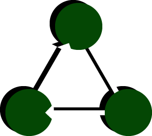
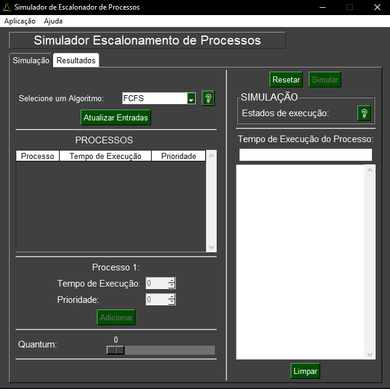

    
    
    

<h1 align="center">
    
    <h1 align="center">Simulador Escalonamento de Processos</h1>
</h1>

### Simulador de Escalonamento de Processos com propósito educacional e didático, desenvolvido para a disciplina de Sistemas Operacionais l

<h1 align="center">
    
</h1>

Conheça o projeto:
=================
<!--ts-->
   * [Sobre](#Sobre)
   * [Interface](#interface)
   * [Como utilizar?](#Como-utilizar)
   * [Algoritmos de Escalonamento](#Algoritmos-de-Escalonamento)
      * [FCFS](#FCFS)
      * [SJFS](#SJFS)
      * [Prioridade](#prioridade)
      * [Loteria](#loteria)
      * [Round Robin](#Round-Robin)
      * [Múltiplas Filas](#múltiplas-Filas)
   * [Ferramentas Utilizadas](#ferramentas-utilizadas)
   * [Referências](#referências)
   * [Autor](#Autor)
<!--te-->

## Sobre 💬

Escalonamento de processos é o ato de realizar o chaveamento dos processos ativos, de acordo com regras bem estabelecidas, de forma que todos os processos tenham chance de utilizar a UCP. O escalonador é a parte do SO encarregada de decidir entre os processos prontos, qual será colocado em execução. A ideia de criar um simulador é para que estudantes e interessados possam compreender e analisar o funcionamento dos algoritmos de escalonamento de processos de forma simples, visual e didática. Todos os algoritmos foram desenvolvidos em Python. A interface foi concebida utilizando a biblioteca gráfica PySimpleGUI.

## Interface 💻

## Como Utilizar? 💡

### ➡ Dúvida sobre o funcionamento do algoritmo?
Clique no ❔ para mostrar o popup com a descrição do algoritmo:

<h1 align="center">
    
</h1>

### ➡ Selecionando algoritmo
⚠ **SEMPRE CLIQUE EM `ATUALIZAR ENTRADAS` APÓS SELECIONAR O ALGORITMO** ⚠

<h1 align="center">
    
</h1>

### ➡ Adicionando processos
**PREENCHA OS DADOS REQUISITADOS POR CADA ALGORITMO E CLIQUEM EM `ADICIONAR` PARA INSERIR UM NOVO PROCESSO NA FILA**

<h1 align="center">
    
</h1>

### ➡ Simulando o funcionamento do algoritmo
**APÓS ADICIONAR OS PROCESSOS, CLIQUE EM `SIMULAR` PARA DAR INÍCIO A UMA SIMULAÇÃO DO ALGORITMO SELECIONADO**
- 🔴 PROCESSO EM EXECUÇÃO
- 🟡 PROCESSO PAUSADO / NÃO FINALIZADO
- 🟢 PROCESSO FINALIZADO

<h1 align="center">
    
</h1>

### ➡ Visualizando Resultados
- **CLIQUE NA ABA `RESULTADOS` PARA VISUALIZAR OS DADOS GERADOS PELA SIMUAÇÃO**
- **CLIQUE NA ABA `GRÁFICO` PARA VISUALIZAR O GRÁFICO DE GANTT GERADO PELA SIMUAÇÃO**

<h1 align="center">
    
</h1>

## Algoritmos de Escalonmaento
* Funções do escalonamento:
    * Manter a CPU ocupada a maior parte do tempo.
    * Balancear a utilização do processador entre diversos processos.
    * Maximizar o throughput do sistema
    * Oferecer tempos de respostas razoáveis para os usuários interativos.
    * Evitar starvation.
    
* Gráfico de Gantt:
    O gráfico mostra visualmente a ordem e o tempo de execução de cada processo de acordo com o algoritmo que foi selecuionado
    
* Tempo de Espera:  
    Soma dos períodos em que o processo estava no seu estado pronto.
    
* Tempo de Turnaround:
    Tempo transcorrido desde o momento em que o software entra e o instante em que termina sua execução.
    
## FCFS
`First come, First Served:` Primeiro que chega será o primeiro a ser executado.

`Demonstração:`

<h1 align="center">
    <h4>Simulação</h4> 
    
    <h4>Resultados Obtidos</h4>
    
    <h4>Gráfico de Gantt do escalonamento dos processos</h4>
     
</h1>

## SJFS
`Shortest Job First:` Menor processo ganhará a CPU e atrás do mesmo formar uma fila de processos por ordem crescente de tempo de execução, não-preemptivo.

`Demonstração:`

<h1 align="center">
    <h4>Simulação</h4> 
    
    <h4>Resultados Obtidos</h4>
    
    <h4>Gráfico de Gantt do escalonamento dos processos</h4>
     
</h1>

## Prioridade
- Processos possuem diferentes prioridades de execução.
- Processos de maior prioridade são escalonados preferencialmente.
- Mediante um quantum, que interrompe o processador em determinados intervalos de tempo, reavaliando prioridades e, possivelmente, escalonando outro processo.
- Prioridade estática.

`Demonstração:`

<h1 align="center">
    <h4>Simulação</h4> 
    
    <h4>Resultados Obtidos</h4>
    
    <h4>Gráfico de Gantt do escalonamento dos processos</h4>
     
</h1>

## Loteria
Processo com maior token (prioridade) sorteado ganha a vez na CPU.  

`Demonstração:`

<h1 align="center">
    <h4>Simulação</h4> 
    
    <h4>Resultados Obtidos</h4>
    
    <h4>Gráfico de Gantt do escalonamento dos processos</h4>
     
</h1>

## Round Robin
- Caso quantum acabe e o processo não terminou: processo é inserido no fim da fila.
- Caso o processo termina antes de um quantum: a CPU é liberada para a execução de novos processos.

`Demonstração:`

<h1 align="center">
    <h4>Simulação</h4> 
    
    <h4>Resultados Obtidos</h4>
    
    <h4>Gráfico de Gantt do escalonamento dos processos</h4>
     
</h1>

## Múltiplas Filas
- Cada processo é colocado em uma fila, e cada fila tem uma política de escalonamento própria e outra entre filas.
- Cada fila tem um determinado nível de prioridade.
- Sem realimentação.

`Demonstração:`

<h1 align="center">
    <h4>Simulação</h4> 
    
    <h4>Resultados Obtidos</h4>
    
    <h4>Gráfico de Gantt Fila 1 (FCFS)</h4>                             
    
    <h4>Gráfico de Gantt Fila 2 (Round Robin)</h4>
     
</h1>

## Garantido
Garante aos processos sua execução, dando a todos eles a mesma quantidade de tempo de execução utilizando a CPU.

`Demonstração:`

<h1 align="center">
    <h4>Simulação</h4> 
    
    <h4>Resultados Obtidos</h4>
    
    <h4>Gráfico de Gantt do escalonamento dos processos</h4>
     
</h1>

## 🛠 Ferramentas Utilizadas

- 🔗[Python](https://www.python.org/)
- 🔗[PySimpleGUI](https://pypi.org/project/PySimpleGUI/)
- 🔗[Matplotlib](https://matplotlib.org/)

## Referências ✔

- 🔗[GSIGMA - UFSC](https://www.gsigma.ufsc.br/~popov/aulas/so1/cap8so.html)
- 🔗[Escalonamento de Processos - Alex Coletta](https://alexcoletta.eng.br/artigos/escalonamento-de-processos/#:~:text=Escalonamento%20de%20processos%20%C3%A9%20o,qual%20ser%C3%A1%20colocado%20em%20execu%C3%A7%C3%A3o.)
- 🔗[Scheduling (computing)](https://en.wikipedia.org/wiki/Scheduling_(computing))
- 🔗[Escalonamento de processos](https://pt.wikipedia.org/wiki/Escalonamento_de_processos)

## Autor👨🏼‍💻

    
    <h3 align="center">Pedro Pauletti</h3>

